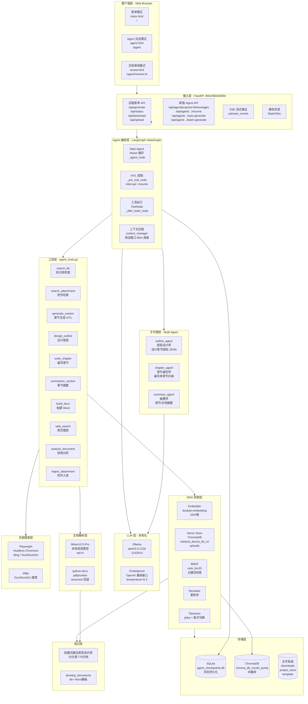
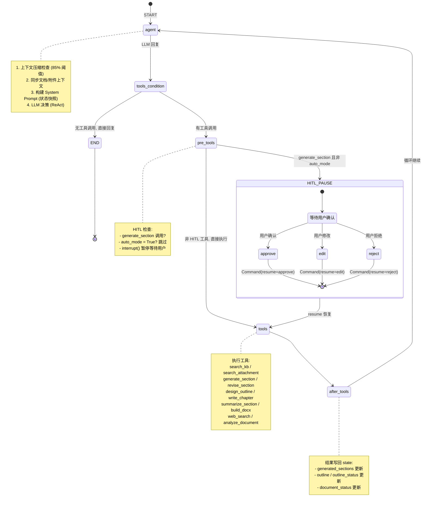
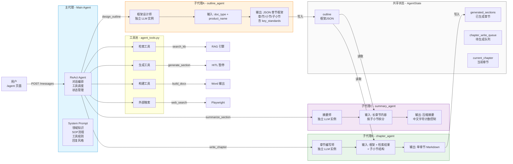
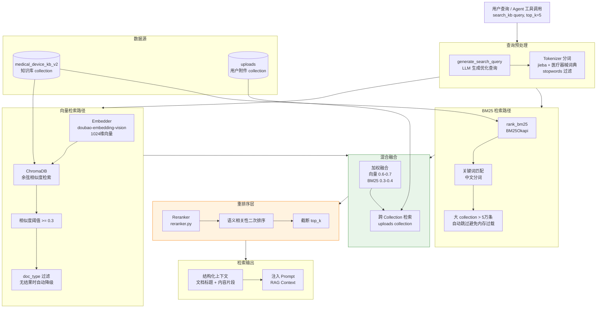
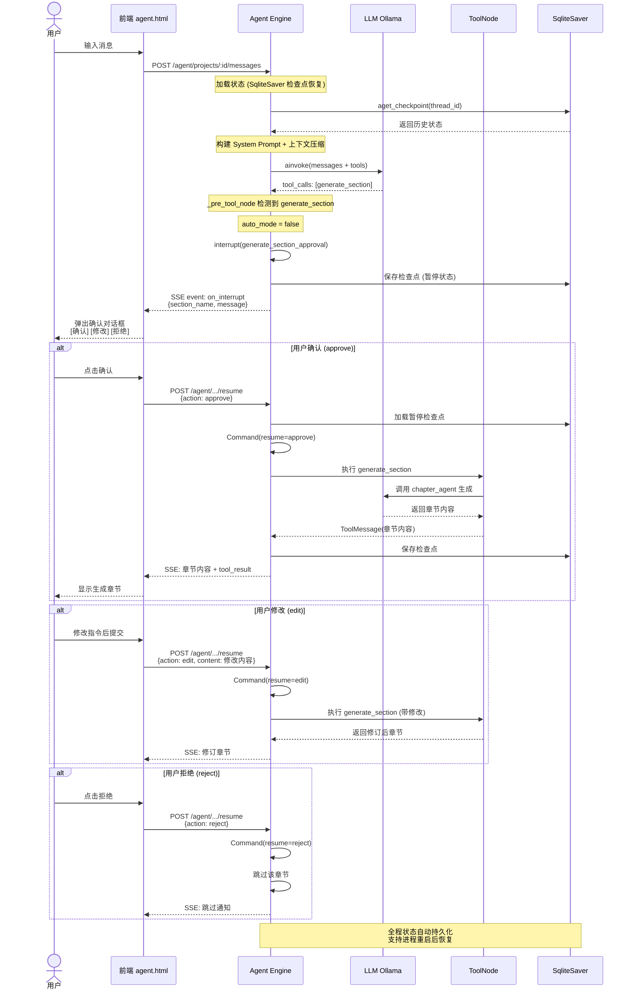
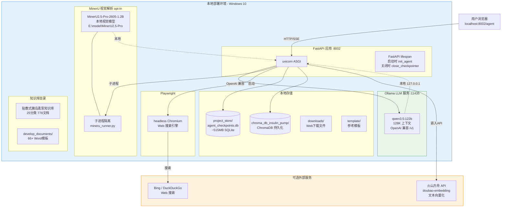
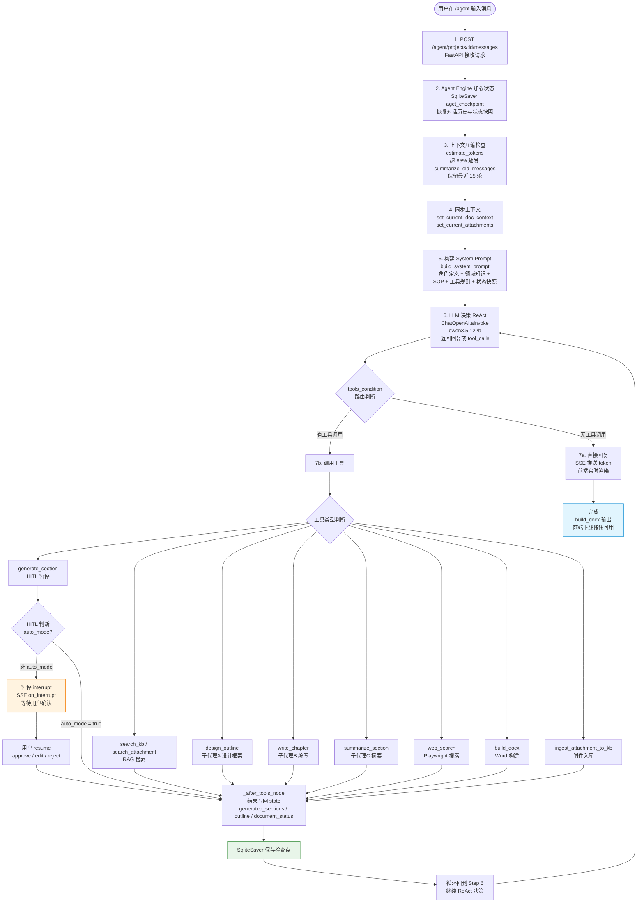

# 设计策划文档生成系统 v2.0 技术架构图

> 本文档通过多视角的 Mermaid 图表，详细描述系统的技术架构、Agent 状态机、多代理协作、RAG 检索流水线、HITL 交互流程与部署拓扑。

---

## 1. 系统总体架构图（分层视图）

---

## 2. Agent 状态机流程图（LangGraph StateGraph）

---

## 3. 多代理协作架构图

---

## 4. RAG 检索流水线图

---

## 5. HITL 人机协同交互时序图

---

## 6. 部署架构图

---

## 7. 完整请求处理数据流图

---

## 8. Agent 状态快照结构图

```mermaid
graph LR
    subgraph STATE["AgentState - TypedDict (PRD Section 4.3)"]
        M["messages<br/>消息历史<br/>add_messages 累加"]

        subgraph S1["步骤1: 产品画像"]
            S1A["product_name"]
            S1B["product_classification"]
            S1C["product_intended_use"]
            S1D["product_status<br/>confirmed / partial"]
        end

        subgraph S2["步骤2: 标准适用性"]
            S2A["confirmed_standards<br/>list"]
            S2B["candidate_standards<br/>list"]
            S2C["standards_status"]
        end

        subgraph S3["步骤3: 内容采集"]
            S3A["content_sections<br/>dict<br/>域: status, items_confirmed, items_skipped"]
        end

        subgraph S4["步骤4: 文档生成"]
            S4A["generated_sections<br/>dict 章节标题: content"]
            S4B["document_status"]
        end

        subgraph S5["步骤5: 追溯矩阵"]
            S5A["traceability_status"]
        end

        subgraph S6["步骤6: 审核评审"]
            S6A["review_status"]
        end

        subgraph MA["多代理协作"]
            MA1["outline<br/>JSON 框架"]
            MA2["outline_status<br/>not_started / draft / confirmed / revised"]
            MA3["current_chapter"]
            MA4["chapter_write_queue<br/>list"]
        end

        subgraph ATT["附件管理"]
            ATT1["attachments<br/>list of dict<br/>file_id, filename,<br/>char_count, preview,<br/>full_text, status"]
        end

        subgraph CTRL["控制标志"]
            C1["doc_type<br/>目标文档类型"]
            C2["auto_mode<br/>跳过 HITL"]
            C3["unresolved_items<br/>待处理项"]
        end
    end

    PERSIST[("SqliteSaver<br/>agent_checkpoints.db<br/>每轮自动持久化<br/>支持中断恢复")]

    STATE -.->|"自动检查点"| PERSIST
    PERSIST -.->|"恢复"| STATE

    style S1 fill:#e1f5fe,stroke:#0288d1
    style S2 fill:#e8f5e9,stroke:#388e3c
    style S3 fill:#fff3e0,stroke:#f57c00
    style S4 fill:#f3e5f5,stroke:#7b1fa2
    style MA fill:#fafafa,stroke:#616161
    style PERSIST fill:#ffebee,stroke:#c62828
```

---

## 9. 图例与说明

| 图表编号 | 名称 | 视角 | 说明 |
|----------|------|------|------|
| 1 | 系统总体架构图 | 分层视图 | 展示客户端、接入层、Agent编排、子代理、工具、RAG、LLM、存储等全部层级 |
| 2 | Agent 状态机流程图 | LangGraph 视角 | 展示 StateGraph 的节点流转、HITL 暂停/恢复机制 |
| 3 | 多代理协作架构图 | Agent 协作视角 | 展示主代理与3个子代理的调用关系和共享状态 |
| 4 | RAG 检索流水线图 | 检索视角 | 展示向量检索 + BM25 + Reranker 的混合检索流水线 |
| 5 | HITL 交互时序图 | 交互视角 | 展示用户确认/修改/拒绝章节的完整时序 |
| 6 | 部署架构图 | 部署视角 | 展示本地服务、端口、存储和可选外部服务 |
| 7 | 完整请求处理数据流图 | 端到端视角 | 展示从用户输入到文档输出的完整数据流转 |
| 8 | Agent 状态快照结构图 | 数据视角 | 展示 AgentState 的6步状态字段和持久化机制 |

> **渲染说明**：以上 Mermaid 图表可在 GitHub、VS Code（Mermaid 插件）、Typora、Notion 等支持 Mermaid 的编辑器中直接渲染。也可使用 [mermaid.live](https://mermaid.live) 在线预览。
